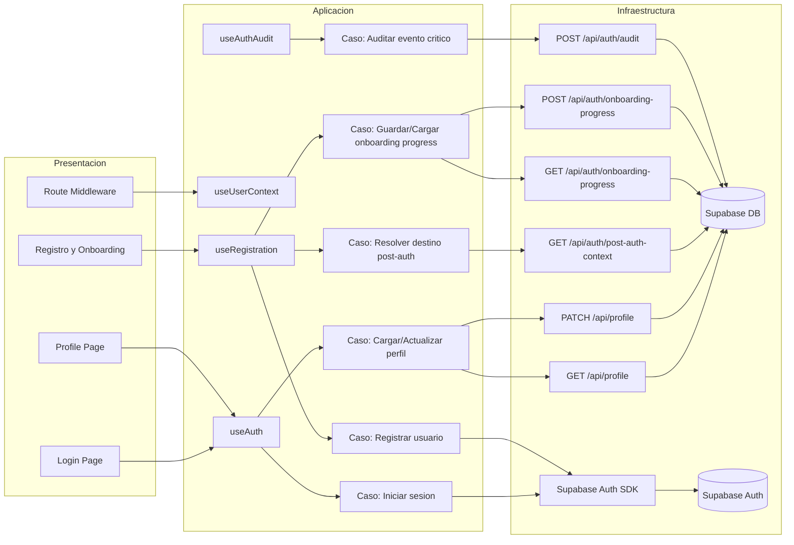

# Auth Module - Use Case Diagram by Layers

## Scope
- Module: `auth` (Ola 0 - Auth First)
- Architecture view: Presentacion / Aplicacion / Infraestructura

## Diagram (Mermaid)

## Notes
- Session lifecycle stays in client (`supabase.auth.*`) to preserve browser session/cookies.
- Business data and tenant-sensitive writes are resolved through backend endpoints (`/api/*`).
- Auth audit is now backend-only via `POST /api/auth/audit`.
